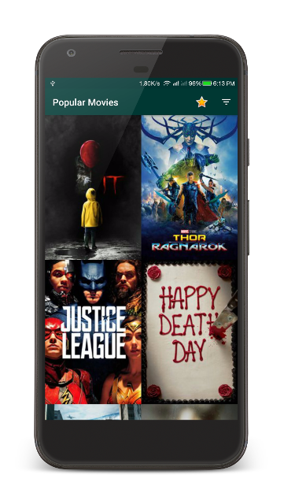

#### (Udacity Android Developer Nanodegree Project 1 and 2)
# Popular Movies
### An app to allow users to discover the most popular movies. It displays a scrolling grid of movie trailers, launches a details screen whenever a particular movie is selected, allows users to save favorites, play trailers, and read user reviews.

---

* Technologies: Java, XML, SQLite
* Platform Features: Content Provider, AsyncTask, Loader, RecyclerView, Shared Preferences
* Libraries: Android Support, OkHttp, Picasso,
* Tools and OS : Android Studio, Ubuntu
* Platform: Android 4.0+
* Modules: Movies, Favorites
* Lines of Code:  16547
* Duration: 1 Week (NOV 2017)

### Screenshots

---
#### API Key Insertion

Insert API Key in <your_home_directory>/.gradle/gradle.properties file as follows.

MovieDbApiKey="<your_key>"

